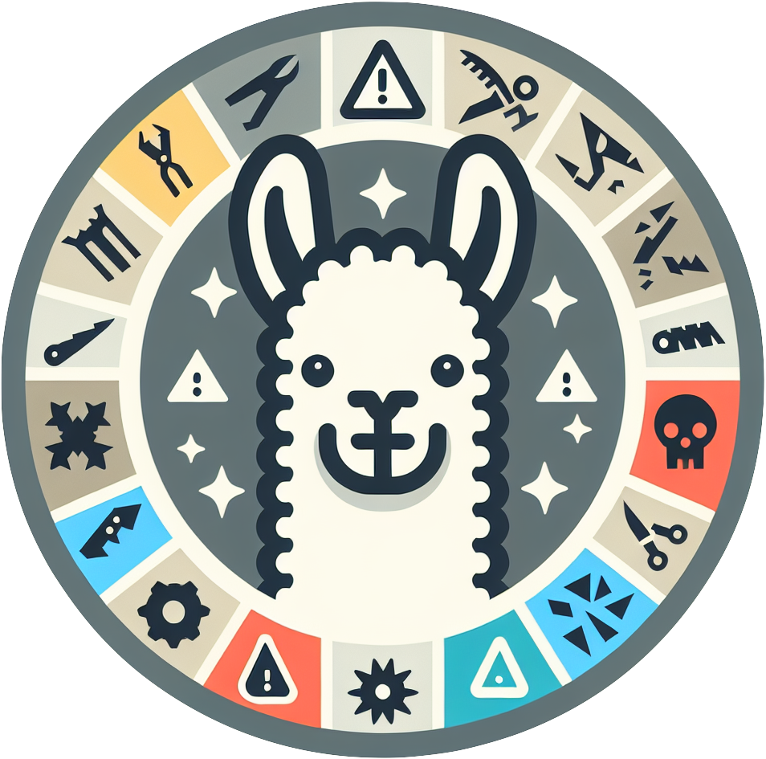

#  DiveR-CT

**Official code for AAAI25 paper for red teaming: [DiveR-CT: Diversity-enhanced Red Teaming Large Language Model Assistants with Relaxing Constraints](https://arxiv.org/abs/2405.19026)**

```
                  _______ ______
                  |     / |    /
       O          |    /  |   /
                  |   /   |  /
    o  O 0         \  \   \  \
    o               \  \   \  \
       o            /  /   /  /
        o     /\_  /\\\   /  /
         O  /    /    /     /
 ..       /    /    /\=    /
.  ))))))) = /====/    \
. (((((((( /    /\=  _ }
. |-----_|_+( /   \}
. \_<\_//|  \  \ }
 ...=Q=  |==)\  \
   \----/     ) )
             / /
            /=/
          \|/
          o}
```

[](https://arxiv.org/abs/2405.19026)
[](https://opensource.org/licenses/MIT)

## Table of Contents
- [ DiveR-CT](#-diver-ct)
  - [Table of Contents](#table-of-contents)
  - [About](#about)
  - [Installation](#installation)
  - [Red Teaming with DiveR-CT](#red-teaming-with-diver-ct)
  - [Evaluation](#evaluation)
  - [Safety Tuning](#safety-tuning)
  - [Cite](#cite)

## About

DiveR-CT is a novel approach to red teaming, focusing on enhancing diversity by *relaxing constraints*.

## Installation

To get started with DiveR-CT, follow these steps:

```bash
conda create -n diver-ct python=3.10
conda activate diver-ct
pip install -r requirements.txt
```

## Red Teaming with DiveR-CT
```bash
accelerate launch --config_file=accelerate_configs/multi_gpu.yaml \
    --main_process_port 20199 --num_processes 4 -m red_teaming.scripts.train_constrained_red_team \
    --model_name vicgalle/gpt2-alpaca-gpt4 \
    --query_dataset red_teaming/data/alpaca.jsonl \
    --red_generation_kwargs_max_length 512 \
    --blue_generation_kwargs_max_length 512 \
    --log_with wandb \
    --batch_size 64 \
    --mini_batch_size 8 \
    --lr_scheduler_type constant \
    --lr_warmup_ratio 0.0 \
    --blue_safety_reward False \
    --blue_gibberish_reward False \
    --lagrange_max 10.0 \
    --steps 2000 \
    --need_eval False \
    --log_freq 10000 \
    --run_name test \
    --seed 0 \
    --lagrange_lr 0.2 \
    --scale_logits True \
    --separate_critics False \
    --max_grad_norm 10.0 \
    --semantic_reward_module SemanticDiversityScore \
    --semantic_reward_kwarg_top_k 16
```

## Evaluation
```bash
python red_teaming/evaluation/eval_utils_scripts.py
```

## Safety Tuning
```bash
accelerate launch --config_file=accelerate_configs/multi_gpu.yaml \
    --main_process_port 29501 --num_processes 4 -m red_teaming.sft.train \
    --model_name_or_path="vicgalle/gpt2-alpaca-gpt4" \
    --report_to="wandb" \
    --learning_rate=1e-5 \
    --per_device_train_batch_size=64 \
    --gradient_accumulation_steps=16 \
    --output_dir="logs/gpt2-alpaca-gpt4" \
    --logging_steps=10 \
    --num_train_epochs=1.0 \
    --max_steps=-1 \
    --dataset_name logs/run \
    --per_device_train_batch_size 4 \
    --run_name run
```

## Cite
```bibtex
@inproceedings{zhao2025diver,
  title={DiveR-CT: Diversity-enhanced Red Teaming with Relaxing Constraints},
  author={Zhao, Andrew and Xu, Quentin and Lin, Matthieu and Wang, Shenzhi and Liu, Yong-jin and Zheng, Zilong and Huang, Gao},
  booktitle={Proceedings of the AAAI Conference on Artificial Intelligence},
  volume={39},
  year={2025}
}
```